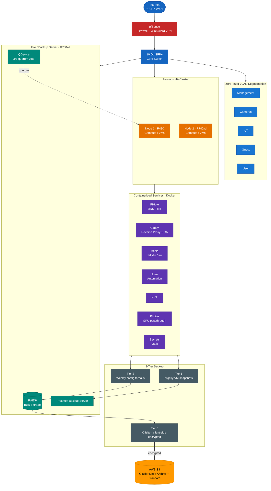

# Home Infrastructure Lab

A self-directed, production-grade home lab I built to develop and demonstrate hands-on
infrastructure, cloud, and DevSecOps skills. Everything here is self-taught and self-hosted,
run against real uptime, backup, and recovery expectations — not a tutorial sandbox.

> This README documents the architecture and design decisions. Configuration files with
> environment-specific values (addresses, hostnames, secrets) are intentionally kept private.

---

## Overview

Three enterprise Dell PowerEdge servers running a mix of virtualization, containerized
services, segmented networking, and a multi-tier backup pipeline that reaches offsite cloud
storage. Designed for high availability where it matters, least-privilege access throughout,
and graceful failure under power or hardware loss.

## Compute & Virtualization

- **2-node Proxmox VE high-availability cluster** (Dell R430 + R740xd) providing compute and VMs.
- **Quorum via an external QDevice** (corosync-qnetd) running on a third host, so the cluster
  stays quorate and tolerant when a single node is lost.
- **Separate Ubuntu file/backup server** (Dell R730xd) holding bulk storage on a large RAID6
  array, plus the backup datastore — deliberately *not* a cluster compute member.
- Dual **UPS** units with a monitoring daemon that triggers coordinated, graceful shutdown
  when either unit drops below a safe runtime threshold.

## Networking & Segmentation

- **pfSense** virtual firewall/gateway as the network core.
- **Zero-trust-modeled segmentation** across separate VLANs for management, cameras, IoT, guest,
  and default user traffic, on a **10 Gb SFP+ backbone**.
- **WireGuard** for encrypted remote access.
- **PiHole** for network-wide DNS filtering.
- Internal **certificate authority and reverse proxy (Caddy)** issuing certs for internal
  services on a private domain.

## Services

15+ self-hosted production services in **Docker / Docker Compose**, including media streaming
and management, home automation, a network video recorder, self-hosted photo management with
GPU passthrough, secrets management, and monitoring/feeds. External-facing traffic runs behind
a VPN killswitch so a VPN drop fails closed rather than leaking.

## Backup Strategy (3 tiers)

1. **VM snapshots** — nightly, automated, with retention (Proxmox Backup Server).
2. **Config tarballs** — weekly rolling backups of service configurations.
3. **Offsite** — data is **client-side encrypted locally before upload**, then synced to
   **AWS S3** (Glacier Deep Archive for cold data, Standard for configs) under a
   **least-privilege IAM policy**. Encryption happens before anything leaves the network.

## What I'm Building Next (GitOps migration — in progress)

Migrating the Docker-Compose stack to a declarative, version-controlled platform:

- **Terraform / OpenTofu** for infrastructure provisioning
- **Ansible** for configuration management
- **k3s** (lightweight Kubernetes) with **Argo CD** for GitOps-style continuous delivery
- A **CI/CD supply-chain-security pipeline**: image scanning (Trivy), secret scanning
  (gitleaks), SBOM generation (Syft), image signing (Cosign), and admission control (Kyverno)

## Skills Demonstrated

Linux & Windows server administration · Proxmox virtualization & HA · Docker / Docker Compose ·
network segmentation & firewall design · WireGuard VPN · DNS filtering · AWS S3 / IAM ·
encrypted backup & disaster recovery · infrastructure documentation · (building) Terraform,
Ansible, Kubernetes, CI/CD.

## Architecture

End-to-end topology: internet ingress through a segmented firewall, a Proxmox HA cluster
with external-quorum file/backup server, a containerized service stack, and a 3-tier backup
pipeline that ends in client-side-encrypted offsite cloud storage.

